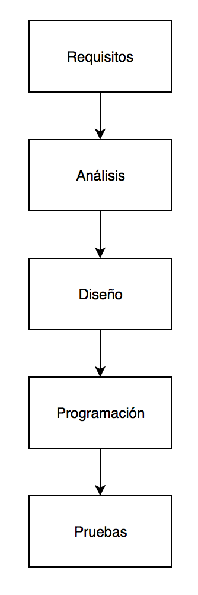

# Flujo de trabajo tradicional:

El flujo de trabajo tradicional en el desarrollo de sofware es de sobra conocido por todos nostros:

1. Captura de requisitos
2. Análisis
3. Diseño
4. Programación
5. Pruebas

