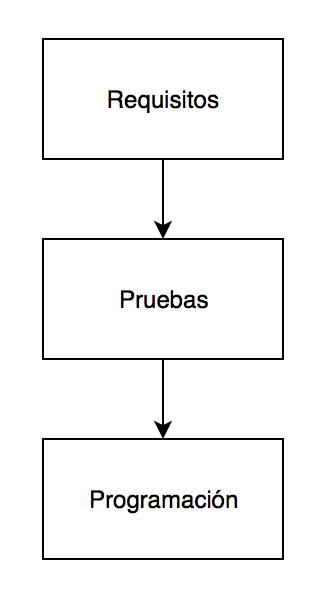

# Flujo de trabajo con TDD

El flujo de trabajo con TDD es radicalmente distinto, desaparecen las fases de análisis 
y diseño y además, ¡se escriben los tests antes que le código!.

El único análisis necesario antes de empezar es el de los componentes y el lenguaje a utilizar para el desarrollo y el framework (o frameworks) a utilizar para el testeo.

Por ejemplo, Para el desarrollo: Servidor Web Apache con Symfony (PHP) para API REST en el lado servidor, base de datos MySQL y Angular (Javascript) en el lado del cliente. Para el testeo: PhpUnit integrado en Symfony para el código del servidor y Selenium para el cliente.

## ¿Cuándo surge TDD?

Aunque es difícil de concretar una fecha, se puede decir que la técnica de TDD tiene sus raíces en la *programación extrema (Extreme Programming)* surgida a finales de los años 90. Uno de los pilares básicos de las misma es el *"Test First"*.

En muy poco tiempo el concepto *"Test First"* derivó en *"Test Driven"* y en 2003, con la publicación del libro *"Test Driven Development: By Example"* de Kent Beck se 
empezó a expandir y a consolidar alrededor del mundo. Aunque parezca novedosa, en realidad es una técnica bastante madura que además ha alentado innovaciones derivadas de la misma tales como ATDD (Acceptance Test Driven Development) o BDD (Behaviour Driven Development).

Hoy en día es ampliamente utilizada por la Comunidad Ágil (Agile Community).
